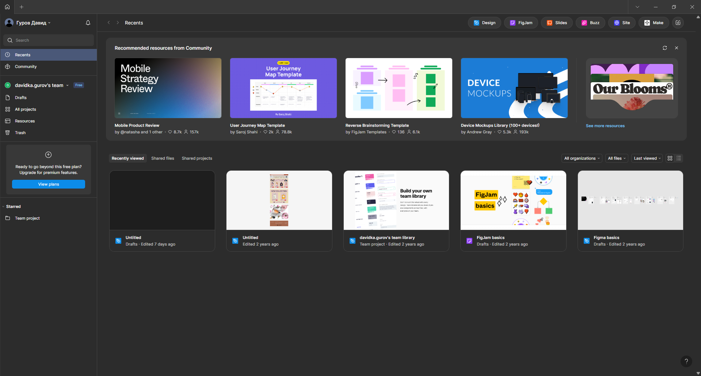

# Практична робота №1
**Тема:** Реєстрація у Figma та ознайомлення з інтерфейсом  

## Хід роботи
1. Я зареєструвався у Figma.  
     

2. Я відкрив новий файл у Figma та ознайомився з інтерфейсом програми.  
     

## Висновки
На цій практичній роботі я зареєструвався у Figma та зробив перші кроки у роботі з інтерфейсом.  
Я навчився створювати новий проєкт і орієнтуватися в основних елементах інтерфейсу.
