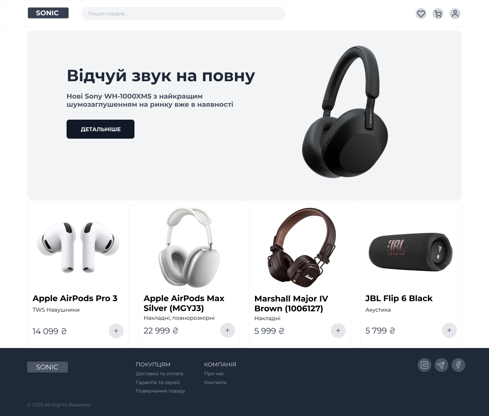
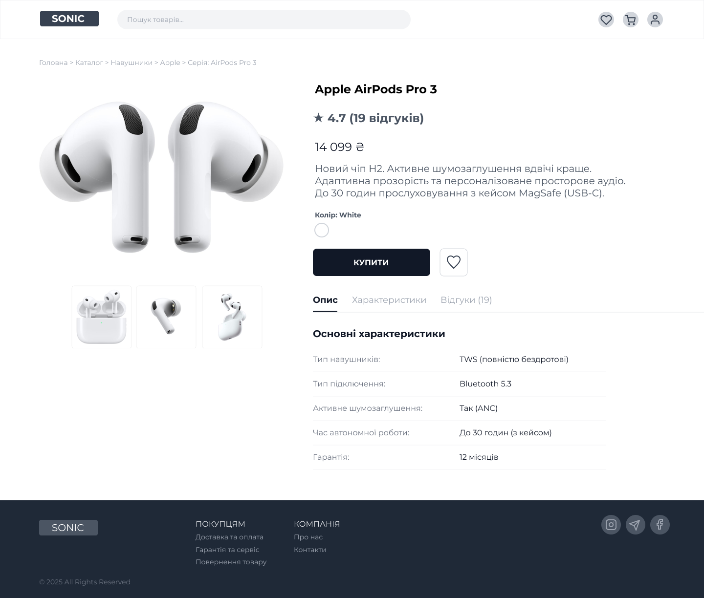
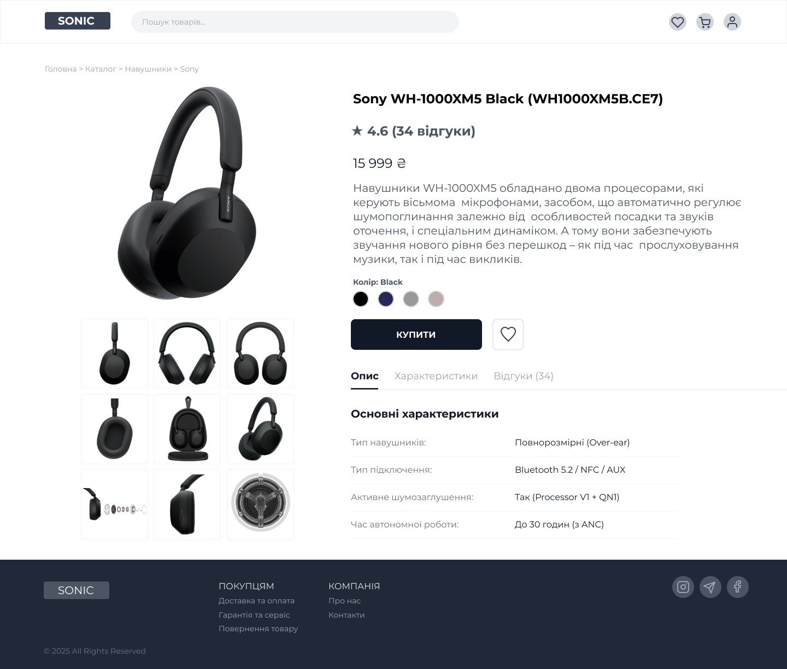

# Практична робота №12
**Тема:** Розробка wireframe

## Мета роботи
Створити деталізований вайрфрейм сайту інтернет-магазину у Figma (головна сторінка та 2–3 сторінки товару).  
Застосувати інструменти прототипування для створення клікабельного прототипу.  
Розмір екранів — **desktop**.

## Хід роботи

1. Обрав тематику — інтернет-магазин аудіотехніки.  
2. Створив вайрфрейм у Figma, використовуючи:
   - базові фігури та компоненти;
   - текстові стилі;
   - логічну структуру UX-патернів.
3. Розробив три основні сторінки:
   - **Головна сторінка**
   - **Сторінка товару — Sony WH-1000XM5**
   - **Сторінка товару — Apple AirPods Pro 3**
4. Налаштував клікабельний прототип за допомогою інструментів **Prototype**.
5. Перевірив роботу зв’язків у режимі презентації.

## Результати роботи

### 1. Головна сторінка

### 2. Сторінка товару — Apple AirPods Pro 3

### 3. Сторінка товару — Sony WH-1000XM5

## Посилання на дизайн у Figma
[Відкрити дизайн у Figma](https://www.figma.com/design/jZoHkJhgQnYeniI0XJjKp5/Sonic?m=auto&t=BMZUSS7CnBlzvNEF-6)

## Висновок
У ході виконання практичної роботи я створив деталізований вайрфрейм інтернет-магазину, що включає головну сторінку та сторінки товарів.  
Використав прототипування, компоненти та сітки для структурування інтерфейсу.  
Отриманий клікабельний прототип може бути використаний як основа для подальшої розробки повноцінного UI-дизайну.
