# Практична робота №13
**Тема:** Дослідження кольорових гармоній (Adobe Color)

## Мета
Ознайомлення з поняттям кольорової гармонії, побудова палітр за допомогою Adobe Color та перевірка доступності (контрастності) інтерфейсних рішень.

## 1. Теоретичні відомості
**Кольорова гармонія** — це естетично приємне поєднання кольорів, яке викликає у глядача позитивне сприйняття. Гармонійні палітри створюються на основі геометричних відносин на колірному колі (протилежні кольори, сусідні тощо).

## 2. Колірне колесо (Color Wheel)
**Базовий колір:** #4B5DB8 (Синій)

### 2.1. Analogous (Аналогічна)
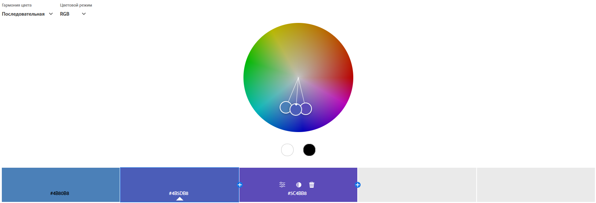
*Тип:* Послідовна (Analogous)
*Емоційний ефект:* Спокійна та приємна для ока палітра, оскільки використовуються сусідні кольори. Добре підходить для фонових елементів.

### 2.2. Monochromatic (Монохроматична)
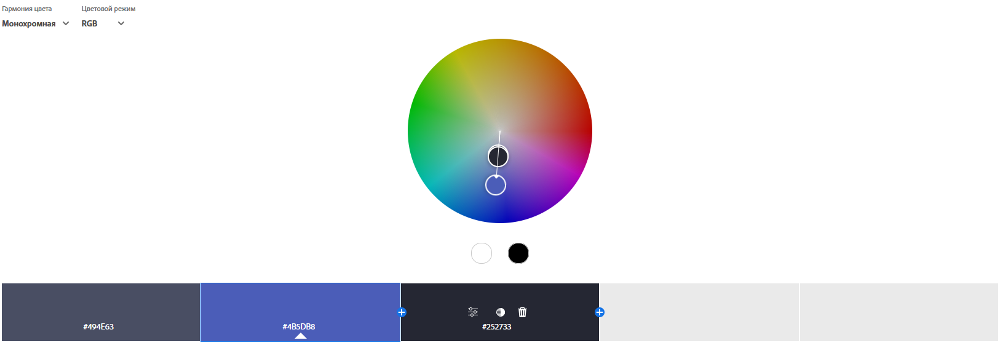
*Тип:* Монохромна
*Емоційний ефект:* Стримана та мінімалістична. Створює відчуття порядку та елегантності.

### 2.3. Triad (Тріада)
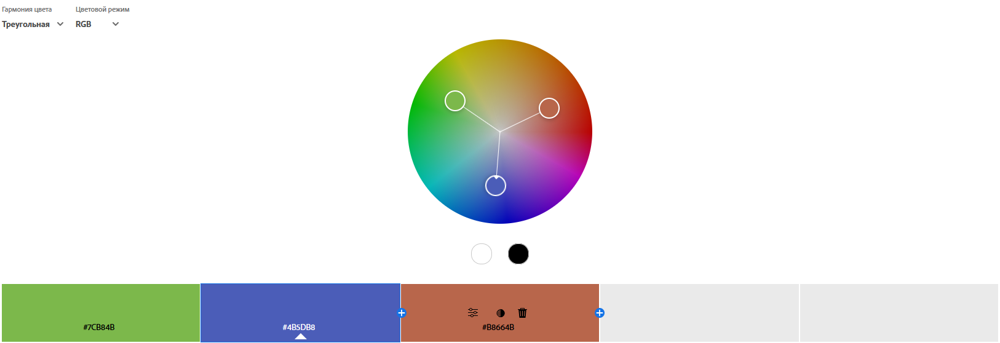
*Тип:* Трикутна (Triad)
*Емоційний ефект:* Жива та збалансована. Дозволяє виділити акценти, зберігаючи гармонію.

### 2.4. Complementary (Комплементарна)
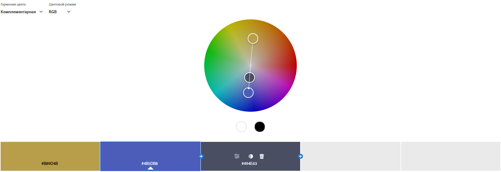
*Тип:* Комплементарна
*Емоційний ефект:* Високий контраст. Дуже динамічна, привертає увагу, але може бути агресивною, якщо використовувати надмірно.

### 2.5. Split Complementary (Розділена комплементарна)
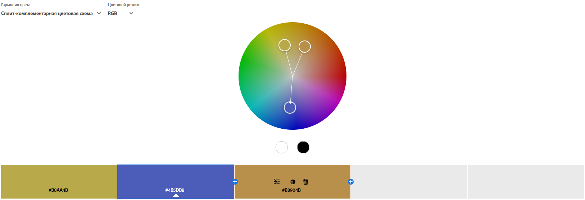
*Тип:* Спліт-комплементарна
*Емоційний ефект:* Контрастна, але менш напружена, ніж звичайна комплементарна схема.

### 2.6. Square (Квадратна)
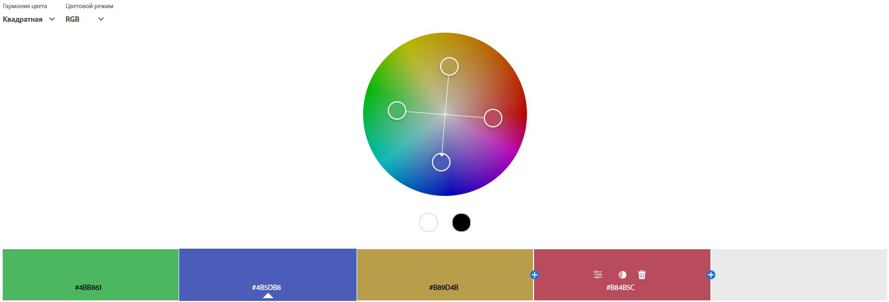
*Тип:* Квадратна
*Емоційний ефект:* Багата на кольори схема, яка потребує обережного балансу (один колір має бути домінуючим).

### 2.7. Custom (Власна)
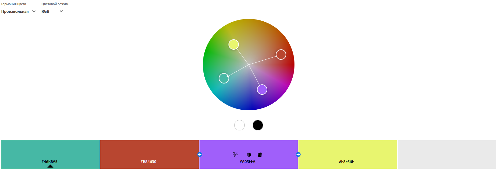
*Тип:* Довільна
*Опис:* Експериментальне поєднання кольорів.

## 3. Створення палітри із зображення (Extract Theme)

### 3.1. Colorful (Барвистий)
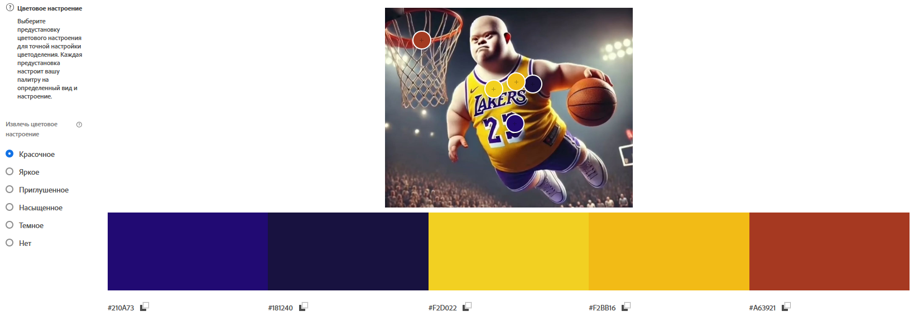
*Настрій:* Яскравий, енергійний.

### 3.2. Muted (Приглушений)
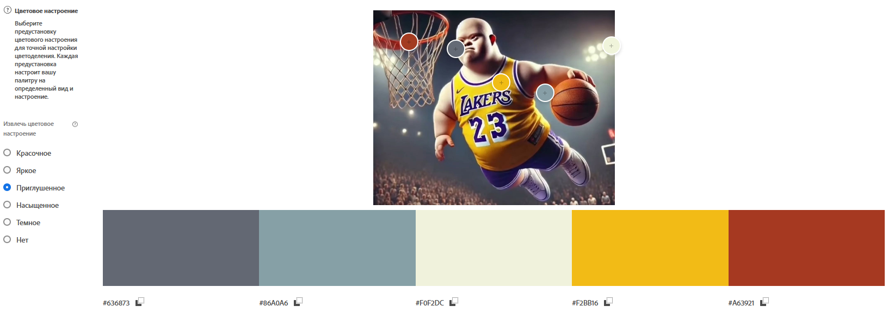
*Настрій:* Спокійний, пастельний.

**Висновок:** Для інтерфейсу інформаційного додатку краще підійде палітра **Muted**, оскільки вона менше навантажує очі користувача і дозволяє краще акцентувати увагу на контенті, а не на фоні.

## 4. Створення градієнта (Extract Gradient)
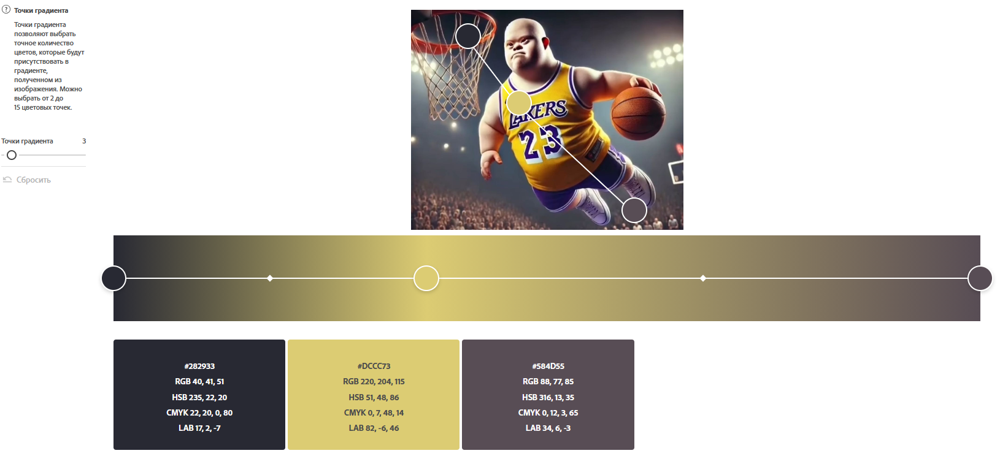
*Опис:* Градієнт побудовано на основі трьох ключових точок із зображення, що передає плавний перехід від темного фону до акцентного жовтого.

## 5. Аналіз контрасту (Accessibility Tools)

Для перевірки було взято кольори з Монохромної палітри.

### Спроба 1 (Невдача)
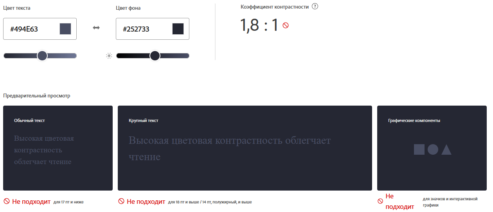
* **Текст:** #494E63
* **Фон:** #252733
* **Результат:** 1.8:1 (Fail). Текст зливається з фоном, читати важко.

### Спроба 2 (Корекція)
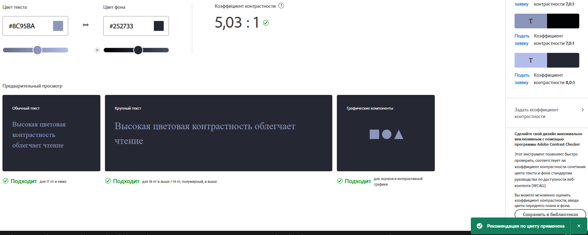
* **Текст:** #8C95BA (після автоматичної корекції)
* **Фон:** #252733
* **Результат:** 5.03:1 (Pass AA).
* **Висновок:** Після освітлення кольору тексту контраст досяг необхідного рівня для комфортного читання звичайного тексту.

## Висновки
Під час виконання роботи було досліджено інструменти Adobe Color. Найбільш універсальними для UI-дизайну видаються **монохромна** та **аналогічна** схеми, оскільки вони найбезпечніші для сприйняття. Перевірка на контрастність показала, що навіть гармонійні кольори не завжди є доступними для читання, тому інструменти Accessibility є обов'язковими у роботі дизайнера.
