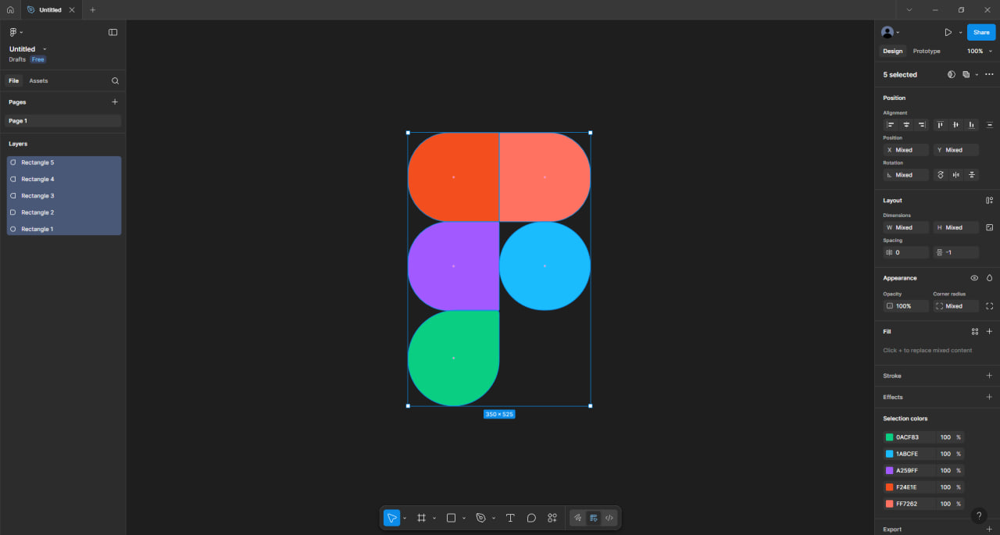

# Практична робота №2
**Тема:** Робота з простими формами та їх властивостями у Figma. Частина 1

## Хід роботи
1. Я відкрив Figma та створив новий файл для дизайну.  
2. Використовуючи інструменти для простих форм (прямокутники, кола, лінії), я створив логотип Figma.  
3. Після завершення роботи зробив скріншот результату:

## Висновки
На цій практичній роботі я навчився створювати прості форми у Figma, змінювати їх властивості (колір, розмір, положення) та комбінувати їх у складніший дизайн.  
Ця робота допомогла мені зрозуміти основи роботи з інтерфейсом Figma і підготовку базових елементів дизайну.

