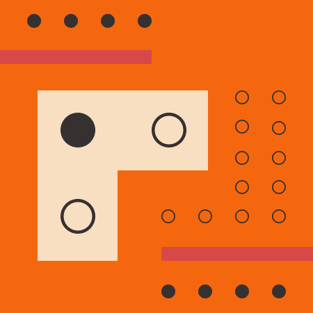

# Практична робота №3
**Тема:** ПЗ-3 Робота з простими формами та їх властивостями у Figma. Створення геометричного візерунку. Частина 2

## Хід роботи
1. Я опрацював матеріал розділу 8 за Керівництвом користувача Figma, щоб ознайомитися з інструментами для роботи з простими формами.  
2. Використовуючи прості фігури (прямокутники, кола, лінії) та їх властивості у Figma, я створив фрагмент геометричного візерунку.  
3. Після завершення роботи зробив скріншот результату:

## Висновки
На цій практичній роботі я навчився:
- створювати прості геометричні форми у Figma,  
- комбінувати їх у складніший візерунок,  
- працювати з властивостями фігур (колір, розмір, положення).  

Ця робота допомогла мені краще зрозуміти основи композиції та використання інструментів Figma для створення графічних елементів.
