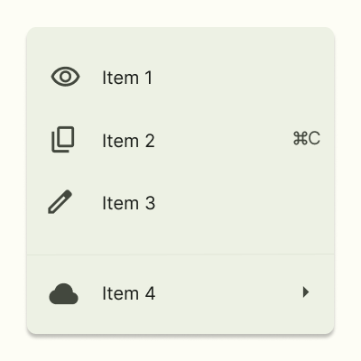

# Практична робота №4
**Тема:** Фрейми, групи і секції у Figma

## Хід роботи

### Завдання Basic
1. Я створив новий файл у Figma для виконання базового завдання.  
2. Використовуючи інструменти **фреймів, груп і секцій**, я повторив елемент дизайну “один в один” відповідно до зразка.  
3. Нижче наведено результат моєї роботи:  

4. Посилання на дизайн у Figma (Basic):  
[Відкрити дизайн у Figma (Basic)](https://www.figma.com/design/9dqXIubZ8a45ItTUjES3pP/Design?m=auto&t=qDXKIuugnPt3M2Fw-6)

---

### Завдання Medium
1. Для завдання Medium я створив ще один дизайн у Figma, де також потрібно було відтворити елемент “один в один”.  
2. Результат другої роботи наведено нижче:  

3. Посилання на дизайн у Figma (Medium):  
[Відкрити дизайн у Figma (Medium)](https://www.figma.com/design/bLs7hWRukwoiG2O7o6oMNu/Design-2?m=auto&t=qDXKIuugnPt3M2Fw-6)

---

## Висновки
На цій практичній роботі я навчився:
- створювати та налаштовувати **фрейми, групи і секції** у Figma;  
- підтримувати логічну структуру під час створення дизайну;  
- точно відтворювати елементи за зразком;  
- працювати з кількома проєктами у межах одного завдання.  

Ця робота допомогла мені покращити навички роботи з фреймами, групами і секціями у Figma та зрозуміти, як організовувати складні дизайни.
